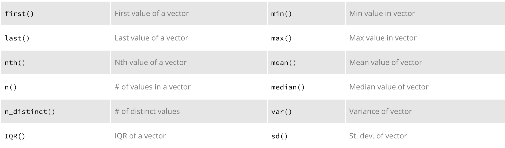

# Transforming Your Data with `dplyr`

Transforming your data is a basic part of data wrangling.  This can include filtering, summarizing, and ordering your data by different means. This also includes combining disperate data sets, creating new variables, and many other manipulation tasks. Although many fundamental data transformation and manipulation functions exist in R, historically they have been a bit convoluted and lacked a consistent and cohesive code structure. Consequently, Hadley Wickham developed the very popular `dplyr` package to make these data processing tasks more efficient along with a syntax that is consistent and easier to remember and read. 

`dplyr`'s roots originate in the popular [`plyr`](https://cran.r-project.org/web/packages/plyr/index.html) package, also produced by Hadley Wickham. `plyr` covers data transformation and manipulation for a range of data structures (data frames, lists, arrays) whereas `dplyr` is focused on transformation and manipulation of data frames. And since the bulk of data analysis leverages data frames I am going to focus on `dplyr`.  Evenso, `dplyr` offers far more functionality than I can cover in one chapter. Consequently, I'm going to cover the seven primary functions `dplyr` provides for data transformation and manipulation. Throughout, I also mention additional, useful functions that can be integrated with these functions. The full list of capabilities can be found in the [`dplyr` reference manual](https://cran.r-project.org/web/packages/dplyr/dplyr.pdf); I highly recommend going through it as there are many great functions provided by `dplyr` that I will not cover here. Also, similar to `tidyr`, `dplyr` has the `%>%` operator baked in to its functionality.

For most of these examples we'll use the following [census data](http://www.census.gov/en.html) which includes the K-12 public school expenditures by state.  This dataframe currently is 50x16 and includes expenditure data for 14 unique years (50 states and has data through year 2011). Here I only show you a subset of the data.

{linenos=off}

```
##   Division      State   X1980    X1990    X2000    X2001    X2002    X2003
## 1        6    Alabama 1146713  2275233  4176082  4354794  4444390  4657643
## 2        9     Alaska  377947   828051  1183499  1229036  1284854  1326226
## 3        8    Arizona  949753  2258660  4288739  4846105  5395814  5892227
## 4        7   Arkansas  666949  1404545  2380331  2505179  2822877  2923401
## 5        9 California 9172158 21485782 38129479 42908787 46265544 47983402
## 6        8   Colorado 1243049  2451833  4401010  4758173  5151003  5551506
##      X2004    X2005    X2006    X2007    X2008    X2009    X2010    X2011
## 1  4812479  5164406  5699076  6245031  6832439  6683843  6670517  6592925
## 2  1354846  1442269  1529645  1634316  1918375  2007319  2084019  2201270
## 3  6071785  6579957  7130341  7815720  8403221  8726755  8482552  8340211
## 4  3109644  3546999  3808011  3997701  4156368  4240839  4459910  4578136
## 5 49215866 50918654 53436103 57352599 61570555 60080929 58248662 57526835
## 6  5666191  5994440  6368289  6579053  7338766  7187267  7429302  7409462
```


## Select variables of interest
When working with a sizable dataframe, often we desire to only assess specific variables.  The `select()` function allows you to select and/or rename variables. Let's say our goal is to only assess the 5 most recent years worth of expenditure data.  Applying the `select()` function we can *select* only the variables of concern.

{linenos=off}

```r
sub_exp <- expenditures %>% select(Division, State, X2007:X2011)
head(sub_exp)  # for brevity only display first 6 rows
##   Division      State    X2007    X2008    X2009    X2010    X2011
## 1        6    Alabama  6245031  6832439  6683843  6670517  6592925
## 2        9     Alaska  1634316  1918375  2007319  2084019  2201270
## 3        8    Arizona  7815720  8403221  8726755  8482552  8340211
## 4        7   Arkansas  3997701  4156368  4240839  4459910  4578136
## 5        9 California 57352599 61570555 60080929 58248662 57526835
## 6        8   Colorado  6579053  7338766  7187267  7429302  7409462
```

We can also apply some of the special functions within `select()`. For instance we can select all variables that start with 'X' (`?select` to see the available functions):

{linenos=off}

```r
expenditures %>% 
        select(starts_with("X")) %>%
        head
##     X1980    X1990    X2000    X2001    X2002    X2003    X2004    X2005
## 1 1146713  2275233  4176082  4354794  4444390  4657643  4812479  5164406
## 2  377947   828051  1183499  1229036  1284854  1326226  1354846  1442269
## 3  949753  2258660  4288739  4846105  5395814  5892227  6071785  6579957
## 4  666949  1404545  2380331  2505179  2822877  2923401  3109644  3546999
## 5 9172158 21485782 38129479 42908787 46265544 47983402 49215866 50918654
## 6 1243049  2451833  4401010  4758173  5151003  5551506  5666191  5994440
##      X2006    X2007    X2008    X2009    X2010    X2011
## 1  5699076  6245031  6832439  6683843  6670517  6592925
## 2  1529645  1634316  1918375  2007319  2084019  2201270
## 3  7130341  7815720  8403221  8726755  8482552  8340211
## 4  3808011  3997701  4156368  4240839  4459910  4578136
## 5 53436103 57352599 61570555 60080929 58248662 57526835
## 6  6368289  6579053  7338766  7187267  7429302  7409462
```

You can also de-select variables by using "-" prior to name or function.  The following produces the inverse of functions above:

{linenos=off}

```r
expenditures %>% select(-X1980:-X2006)
expenditures %>% select(-starts_with("X"))
```

And for convenience, you can rename selected variables with two options:

{linenos=off}

```r
# select and rename a single column
expenditures %>% select(Yr_1980 = X1980)

# Select and rename the multiple variables with an "X" prefix:
expenditures %>% select(Yr_ = starts_with("X"))

# keep all variables and rename a single variable
expenditures %>% rename(`2011` = X2011)
```


## Filter rows 
Filtering data is a common task to identify/select observations in which a particular variable matches a specific value/condition. The `filter()` function provides this capability. Continuing with our `sub_exp` dataframe which includes only the recent 5 years worth of expenditures, we can filter by `Division`:

{linenos=off}

```r
sub_exp %>% filter(Division == 3)
##   Division     State    X2007    X2008    X2009    X2010    X2011
## 1        3  Illinois 20326591 21874484 23495271 24695773 24554467
## 2        3   Indiana  9497077  9281709  9680895  9921243  9687949
## 3        3  Michigan 17013259 17053521 17217584 17227515 16786444
## 4        3      Ohio 18251361 18892374 19387318 19801670 19988921
## 5        3 Wisconsin  9029660  9366134  9696228  9966244 10333016
```

We can apply multiple logic rules in the `filter()` function such as:

{linenos=off}

```r
<   Less than                    !=      Not equal to
>   Greater than                 %in%    Group membership
==  Equal to                     is.na   is NA
<=  Less than or equal to        !is.na  is not NA
>=  Greater than or equal to     &,|,!   Boolean operators
```

For instance, we can filter for Division 3 and expenditures in 2011 that were greater than $10B.  This results in Indiana being excluded since it falls within division 3 and its expenditures were < $10B*(FYI - the raw census data are reported in units of $1,000)*.

{linenos=off}

```r
# Raw census data are in units of $1,000
sub_exp %>% filter(Division == 3, X2011 > 10000000)
##   Division     State    X2007    X2008    X2009    X2010    X2011
## 1        3  Illinois 20326591 21874484 23495271 24695773 24554467
## 2        3  Michigan 17013259 17053521 17217584 17227515 16786444
## 3        3      Ohio 18251361 18892374 19387318 19801670 19988921
## 4        3 Wisconsin  9029660  9366134  9696228  9966244 10333016
```

There are additional filtering and subsetting functions that are quite useful:

{linenos=off}

```r
# remove duplicate rows
sub_exp %>% distinct() 

# random sample, 50% sample size without replacement
sub_exp %>% sample_frac(size = 0.5, replace = FALSE)

# random sample of 10 rows with replacement
sub_exp %>% sample_n(size = 10, replace = TRUE)

# select rows 3-5
sub_exp %>% slice(3:5)

# select top n entries - in this case ranks variable X2011 and selects
# the rows with the top 5 values
sub_exp %>% top_n(n = 5, wt = X2011)
```

## Group data by categorical variables
Often, observations are nested within groups or categories and our goal is to perform statistical analysis both at the observation level and also at the group level.  The `group_by()` function allows us to create these categorical groupings.

The `group_by()` function is a *silent* function in which no observable manipulation of the data is performed as a result of applying the function.  Rather, the only change you'll notice is, when you print the dataframe you will notice underneath the *Source* information and prior to the actual dataframe, an indicator of what variable the data is grouped by will be provided. In the example that follows you'll notice that we grouped by `Division` and there are nine categories for this variable. The real magic of the `group_by()` function comes when we perform summary statistics which we will cover shortly. 

{linenos=off}

```r
group.exp <- sub_exp %>% group_by(Division)

group.exp
## Source: local data frame [50 x 7]
## Groups: Division [9]
## 
##    Division       State    X2007    X2008    X2009    X2010    X2011
##       (int)       (chr)    (int)    (int)    (int)    (int)    (int)
## 1         6     Alabama  6245031  6832439  6683843  6670517  6592925
## 2         9      Alaska  1634316  1918375  2007319  2084019  2201270
## 3         8     Arizona  7815720  8403221  8726755  8482552  8340211
## 4         7    Arkansas  3997701  4156368  4240839  4459910  4578136
## 5         9  California 57352599 61570555 60080929 58248662 57526835
## 6         8    Colorado  6579053  7338766  7187267  7429302  7409462
## 7         1 Connecticut  7855459  8336789  8708294  8853337  9094036
## 8         5    Delaware  1437707  1489594  1518786  1549812  1613304
## 9         5     Florida 22887024 24224114 23328028 23349314 23870090
## 10        5     Georgia 14828715 16030039 15976945 15730409 15527907
## ..      ...         ...      ...      ...      ...      ...      ...

# we can ungroup our data with
ungroup(group.exp)
## Source: local data frame [50 x 7]
## 
##    Division       State    X2007    X2008    X2009    X2010    X2011
##       (int)       (chr)    (int)    (int)    (int)    (int)    (int)
## 1         6     Alabama  6245031  6832439  6683843  6670517  6592925
## 2         9      Alaska  1634316  1918375  2007319  2084019  2201270
## 3         8     Arizona  7815720  8403221  8726755  8482552  8340211
## 4         7    Arkansas  3997701  4156368  4240839  4459910  4578136
## 5         9  California 57352599 61570555 60080929 58248662 57526835
## 6         8    Colorado  6579053  7338766  7187267  7429302  7409462
## 7         1 Connecticut  7855459  8336789  8708294  8853337  9094036
## 8         5    Delaware  1437707  1489594  1518786  1549812  1613304
## 9         5     Florida 22887024 24224114 23328028 23349314 23870090
## 10        5     Georgia 14828715 16030039 15976945 15730409 15527907
## ..      ...         ...      ...      ...      ...      ...      ...
```

## Perform summary statistics on variables
Obviously the goal of all this data *wrangling* is to be able to perform statistical analysis on our data.  The `summarise()` function allows us to perform the majority of summary statistics when performing exploratory data analysis.

Lets get the mean expenditure value across all states in 2011:

{linenos=off}

```r
sub_exp %>% summarise(Mean_2011 = mean(X2011))
##   Mean_2011
## 1  10513678
```

Not too bad, lets get some more summary stats:

{linenos=off}

```r
sub_exp %>% summarise(Min = min(X2011, na.rm = TRUE),
                     Median = median(X2011, na.rm = TRUE),
                     Mean = mean(X2011, na.rm = TRUE),
                     Var = var(X2011, na.rm = TRUE),
                     SD = sd(X2011, na.rm = TRUE),
                     Max = max(X2011, na.rm = TRUE),
                     N = n())
##       Min  Median     Mean         Var       SD      Max  N
## 1 1049772 6527404 10513678 1.48619e+14 12190938 57526835 50
```

This information is useful, but being able to compare summary statistics at multiple levels is when you really start to gather some insights.  This is where the `group_by()` function comes in.  First, let's group by `Division` and see how the different regions compared in by 2010 and 2011.

{linenos=off}

```r
sub_exp %>%
        group_by(Division)%>% 
        summarise(Mean_2010 = mean(X2010, na.rm = TRUE),
                  Mean_2011 = mean(X2011, na.rm = TRUE))
## Source: local data frame [9 x 3]
## 
##   Division Mean_2010 Mean_2011
##      (int)     (dbl)     (dbl)
## 1        1   5121003   5222277
## 2        2  32415457  32877923
## 3        3  16322489  16270159
## 4        4   4672332   4672687
## 5        5  10975194  11023526
## 6        6   6161967   6267490
## 7        7  14916843  15000139
## 8        8   3894003   3882159
## 9        9  15540681  15468173
```

Now we're starting to see some differences pop out.  How about we compare states within a Division?  We can start to apply multiple functions we've learned so far to get the 5 year average for each state within Division 3.

{linenos=off}

```r
library(tidyr)

sub_exp %>%
        gather(Year, Expenditure, X2007:X2011) %>%   # turn wide data to long
        filter(Division == 3) %>%                    # only assess Division 3
        group_by(State) %>%                          # summarize data by state
        summarise(Mean = mean(Expenditure),          # calculate mean & SD
                  SD = sd(Expenditure))
## Source: local data frame [5 x 3]
## 
##       State     Mean        SD
##       (chr)    (dbl)     (dbl)
## 1  Illinois 22989317 1867527.7
## 2   Indiana  9613775  238971.6
## 3  Michigan 17059665  180245.0
## 4      Ohio 19264329  705930.2
## 5 Wisconsin  9678256  507461.2
```

There are several built in summary functions in `dplyr` as displayed below. You can also build in your own functions as well.




## Arranging variables by value
Sometimes we wish to view observations in rank order for a particular variable(s). The `arrange()` function allows us to order data by variables in accending or descending order. Let's say we want to assess the average expenditures by division. We could apply the `arrange()` function at the end to order the divisions from lowest to highest expenditure for 2011.  This makes it easier to see the significant differences between Divisions 8,4,1 & 6 as compared to Divisions 5,7,9,3 & 2.

{linenos=off}

```r
sub_exp %>%
        group_by(Division)%>% 
        summarise(Mean_2010 = mean(X2010, na.rm = TRUE),
                  Mean_2011 = mean(X2011, na.rm = TRUE)) %>%
        arrange(Mean_2011)
## Source: local data frame [9 x 3]
## 
##   Division Mean_2010 Mean_2011
##      (int)     (dbl)     (dbl)
## 1        8   3894003   3882159
## 2        4   4672332   4672687
## 3        1   5121003   5222277
## 4        6   6161967   6267490
## 5        5  10975194  11023526
## 6        7  14916843  15000139
## 7        9  15540681  15468173
## 8        3  16322489  16270159
## 9        2  32415457  32877923
```

We can also apply a *descending* argument to rank-order from highest to lowest.  The following shows the same data but in descending order by applying `desc()` within the `arrange()` function.

{linenos=off}

```r
sub_exp %>%
        group_by(Division)%>% 
        summarise(Mean_2010 = mean(X2010, na.rm = TRUE),
                  Mean_2011 = mean(X2011, na.rm = TRUE)) %>%
        arrange(desc(Mean_2011))
## Source: local data frame [9 x 3]
## 
##   Division Mean_2010 Mean_2011
##      (int)     (dbl)     (dbl)
## 1        2  32415457  32877923
## 2        3  16322489  16270159
## 3        9  15540681  15468173
## 4        7  14916843  15000139
## 5        5  10975194  11023526
## 6        6   6161967   6267490
## 7        1   5121003   5222277
## 8        4   4672332   4672687
## 9        8   3894003   3882159
```


## Joining datasets
Often we have separate dataframes that can have common and differing variables for similar observations and we wish to *join* these dataframes together.  `dplyr` offers multiple joining functions (`xxx_join()`) that provide alternative ways to join data frames:

- inner_join()
- left_join()
- right_join()
- full_join()
- semi_join()
- anti_join()

Our public education expenditure data represents then-year dollars.  To make any accurate assessments of longitudinal trends and comparison we need to adjust for inflation.  I have the following data frame which provides inflation adjustment factors for base-year 2012 dollars *(obviously I should use 2015 values but I had these easily accessable and it only serves for illustrative purposes)*.

{linenos=off}

```
##    Year  Annual Inflation
## 28 2007 207.342 0.9030811
## 29 2008 215.303 0.9377553
## 30 2009 214.537 0.9344190
## 31 2010 218.056 0.9497461
## 32 2011 224.939 0.9797251
## 33 2012 229.594 1.0000000
```

To join to my expenditure data I obviously need to get my expenditure data in the proper form that allows me to join these two data frames.  I can apply the following functions to accomplish this:

{linenos=off}

```r
long_exp <- sub_exp %>%
        gather(Year, Expenditure, X2007:X2011) %>%         # turn to long format
        separate(Year, into=c("x", "Year"), sep = "X") %>% # separate "X" from year value
        select(-x) %>%                                     # remove "x" column
        mutate(Year = as.numeric(Year))                    # convert Year to numeric

head(long_exp)
##   Division      State Year Expenditure
## 1        6    Alabama 2007     6245031
## 2        9     Alaska 2007     1634316
## 3        8    Arizona 2007     7815720
## 4        7   Arkansas 2007     3997701
## 5        9 California 2007    57352599
## 6        8   Colorado 2007     6579053
```

I can now apply the `left_join()` function to join the inflation data to the expenditure data.  This aligns the data in both dataframes by the *Year* variable and then joins the remaining inflation data to the expenditure data frame as new variables.

{linenos=off}

```r

join_exp <- long_exp %>% left_join(inflation)

head(join_exp)
##   Division      State Year Expenditure  Annual Inflation
## 1        6    Alabama 2007     6245031 207.342 0.9030811
## 2        9     Alaska 2007     1634316 207.342 0.9030811
## 3        8    Arizona 2007     7815720 207.342 0.9030811
## 4        7   Arkansas 2007     3997701 207.342 0.9030811
## 5        9 California 2007    57352599 207.342 0.9030811
## 6        8   Colorado 2007     6579053 207.342 0.9030811
```

To illustrate the other joining methods we can use the `a` and `b` data frames from the `EDAWR` package:

{linenos=off}

```r
library(EDAWR)

a
##   x1 x2
## 1  A  1
## 2  B  2
## 3  C  3

b
##   x1    x2
## 1  A  TRUE
## 2  B FALSE
## 3  D  TRUE
```

{linenos=off}

```r
# include all of a, and join matching rows of b
left_join(a, b, by = "x1")
##   x1 x2.x  x2.y
## 1  A    1  TRUE
## 2  B    2 FALSE
## 3  C    3    NA

# include all of b, and join matching rows of a
right_join(a, b, by = "x1")
##   x1 x2.x  x2.y
## 1  A    1  TRUE
## 2  B    2 FALSE
## 3  D   NA  TRUE

# join data, retain only matching rows in both data frames
inner_join(a, b, by = "x1")
##   x1 x2.x  x2.y
## 1  A    1  TRUE
## 2  B    2 FALSE

# join data, retain all values, all rows
full_join(a, b, by = "x1")
##   x1 x2.x  x2.y
## 1  A    1  TRUE
## 2  B    2 FALSE
## 3  C    3    NA
## 4  D   NA  TRUE

# keep all rows in a that have a match in b
semi_join(a, b, by = "x1")
##   x1 x2
## 1  A  1
## 2  B  2

# keep all rows in a that do not have a match in b
anti_join(a, b, by = "x1")
##   x1 x2
## 1  C  3
```

There are additional `dplyr` functions for merging data sets worth exploring:

{linenos=off}

```r
intersect(y, z)	  # Rows that appear in both y and z
union(y, z)	  # Rows that appear in either or both y and z
setdiff(y, z)	  # Rows that appear in y but not z
bind_rows(y, z)	  # Append z to y as new rows
bind_cols(y, z)	  # Append z to y as new columns
```

## Creating new variables
Often we want to create a new variable that is a function of the current variables in our data frame or even just add a new variable.  The `mutate()` function allows us to add new variables while preserving the existing variables. If we go back to our previous `join_exp` dataframe, remember that we joined inflation rates to our non-inflation adjusted expenditures for public schools.  The dataframe looks like:

{linenos=off}

```
##   Division      State Year Expenditure  Annual Inflation
## 1        6    Alabama 2007     6245031 207.342 0.9030811
## 2        9     Alaska 2007     1634316 207.342 0.9030811
## 3        8    Arizona 2007     7815720 207.342 0.9030811
## 4        7   Arkansas 2007     3997701 207.342 0.9030811
## 5        9 California 2007    57352599 207.342 0.9030811
## 6        8   Colorado 2007     6579053 207.342 0.9030811
```

If we wanted to adjust our annual expenditures for inflation we can use `mutate()` to create a new inflation adjusted cost variable which we'll name `Adj_Exp`:

{linenos=off}

```r

inflation_adj <- join_exp %>% mutate(Adj_Exp = Expenditure / Inflation)

head(inflation_adj)
##   Division      State Year Expenditure  Annual Inflation  Adj_Exp
## 1        6    Alabama 2007     6245031 207.342 0.9030811  6915249
## 2        9     Alaska 2007     1634316 207.342 0.9030811  1809711
## 3        8    Arizona 2007     7815720 207.342 0.9030811  8654505
## 4        7   Arkansas 2007     3997701 207.342 0.9030811  4426735
## 5        9 California 2007    57352599 207.342 0.9030811 63507696
## 6        8   Colorado 2007     6579053 207.342 0.9030811  7285119
```

Lets say we wanted to create a variable that rank-orders state-level expenditures (inflation adjusted) for the year 2010 from the highest level of expenditures to the lowest. 

{linenos=off}

```r

rank_exp <- inflation_adj %>% 
        filter(Year == 2010) %>%
        arrange(desc(Adj_Exp)) %>%
        mutate(Rank = 1:length(Adj_Exp))

head(rank_exp)
##   Division      State Year Expenditure  Annual Inflation  Adj_Exp Rank
## 1        9 California 2010    58248662 218.056 0.9497461 61330774    1
## 2        2   New York 2010    50251461 218.056 0.9497461 52910417    2
## 3        7      Texas 2010    42621886 218.056 0.9497461 44877138    3
## 4        3   Illinois 2010    24695773 218.056 0.9497461 26002501    4
## 5        2 New Jersey 2010    24261392 218.056 0.9497461 25545135    5
## 6        5    Florida 2010    23349314 218.056 0.9497461 24584797    6
```

If you wanted to assess the percent change in cost for a particular state you can use the `lag()` function within the `mutate()` function:

{linenos=off}

```r

inflation_adj %>%
        filter(State == "Ohio") %>%
        mutate(Perc_Chg = (Adj_Exp - lag(Adj_Exp)) / lag(Adj_Exp))
##   Division State Year Expenditure  Annual Inflation  Adj_Exp     Perc_Chg
## 1        3  Ohio 2007    18251361 207.342 0.9030811 20210102           NA
## 2        3  Ohio 2008    18892374 215.303 0.9377553 20146378 -0.003153057
## 3        3  Ohio 2009    19387318 214.537 0.9344190 20747992  0.029862103
## 4        3  Ohio 2010    19801670 218.056 0.9497461 20849436  0.004889357
## 5        3  Ohio 2011    19988921 224.939 0.9797251 20402582 -0.021432441
```

You could also look at what percent of all US expenditures each state made up in 2011.  In this case we use `mutate()` to take each state's inflation adjusted expenditure and divide by the sum of the entire inflation adjusted expenditure column.  We also apply a second function within `mutate()` that provides the cummalative percent in rank-order.  This shows that in 2011, the top 8 states with the highest expenditures represented over 50% of the total U.S. expenditures in K-12 public schools.  *(I remove the non-inflation adjusted Expenditure, Annual & Inflation columns so that the columns don't wrap on the screen view)*

{linenos=off}

```r

cum_pct <- inflation_adj %>%
        filter(Year == 2011) %>%
        arrange(desc(Adj_Exp)) %>%
        mutate(Pct_of_Total = Adj_Exp/sum(Adj_Exp),
               Cum_Perc = cumsum(Pct_of_Total)) %>%
        select(-Expenditure, -Annual, -Inflation)
        
head(cum_pct, 8)
##   Division        State Year  Adj_Exp Pct_of_Total  Cum_Perc
## 1        9   California 2011 58717324   0.10943237 0.1094324
## 2        2     New York 2011 52575244   0.09798528 0.2074177
## 3        7        Texas 2011 43751346   0.08154005 0.2889577
## 4        3     Illinois 2011 25062609   0.04670957 0.3356673
## 5        5      Florida 2011 24364070   0.04540769 0.3810750
## 6        2   New Jersey 2011 24128484   0.04496862 0.4260436
## 7        2 Pennsylvania 2011 23971218   0.04467552 0.4707191
## 8        3         Ohio 2011 20402582   0.03802460 0.5087437
```

An alternative to `mutate()` is `transmute()` which creates a new variable and then drops the other variables. In essence, it allows you to create a new data frame with only the new variables created. We can perform the same string of functions as above but this time use transmute to only keep the newly created variables.

{linenos=off}

```r

inflation_adj %>%
        filter(Year == 2011) %>%
        arrange(desc(Adj_Exp)) %>%
        transmute(Pct_of_Total = Adj_Exp/sum(Adj_Exp),
               Cum_Perc = cumsum(Pct_of_Total)) %>%
        head()
##   Pct_of_Total  Cum_Perc
## 1   0.10943237 0.1094324
## 2   0.09798528 0.2074177
## 3   0.08154005 0.2889577
## 4   0.04670957 0.3356673
## 5   0.04540769 0.3810750
## 6   0.04496862 0.4260436
```

Lastly, you can easily also apply the `summarise` and `mutate` functions to multiple columns by using `summarise_each()` and `mutate_each()` respectively.

{linenos=off}

```r
# calculate the mean for each division with summarise_each
# call the function of interest with the `funs()` argument
sub_exp %>%
        select(-State) %>%
        group_by(Division) %>%
        summarise_each(funs(mean)) %>%
        head()
## Source: local data frame [6 x 6]
## 
##   Division    X2007    X2008    X2009    X2010    X2011
##      (int)    (dbl)    (dbl)    (dbl)    (dbl)    (dbl)
## 1        1  4680691  4952992  5173184  5121003  5222277
## 2        2 28844158 30652645 31304697 32415457 32877923
## 3        3 14823590 15293644 15895459 16322489 16270159
## 4        4  4175766  4425739  4658533  4672332  4672687
## 5        5 10230416 10857410 11018102 10975194 11023526
## 6        6  5584277  6023424  6076507  6161967  6267490

# for each division calculate the percent of total 
# expenditures for each state across each year
sub_exp %>%
        select(-State) %>%
        group_by(Division) %>%
        mutate_each(funs(. / sum(.))) %>%
        head()
## Source: local data frame [6 x 6]
## Groups: Division [4]
## 
##   Division      X2007      X2008      X2009      X2010      X2011
##      (int)      (dbl)      (dbl)      (dbl)      (dbl)      (dbl)
## 1        6 0.27958099 0.28357787 0.27498705 0.27063262 0.26298109
## 2        9 0.02184221 0.02387438 0.02515947 0.02682018 0.02846193
## 3        8 0.28093187 0.27793321 0.28144201 0.27229536 0.26854292
## 4        7 0.07854895 0.07565703 0.07402700 0.07474621 0.07630156
## 5        9 0.76650258 0.76625202 0.75304632 0.74962818 0.74380904
## 6        8 0.23648054 0.24272678 0.23179279 0.23848536 0.23857413
```

Similar to the summary function, `dplyr` allows you to build in your own functions to be applied within `mutate_each()` and also has the following built in functions that can be applied.


## Additional resources
This chapter introduced you to `dplyr`'s basic set of tools and demonstrated how to use them on data frames.  Additional resources are available that go into more detail or provide additional examples of how to use `dpyr`. In addition, there are other resouces that illustrate how `dplyr` can perform tasks not mentioned in this chapter such as connecting to remote databases and translating your R code into SQL code for data pulls.

- [Data wrangling presentation](http://bradleyboehmke.github.io/2015/10/data-wrangling-presentation.html) I gave at Miami University
- [`dplyr` reference manual](https://cran.r-project.org/web/packages/dplyr/dplyr.pdf)
- R Studio's [Data wrangling with R and RStudio webinar](http://www.rstudio.com/resources/webinars/)
- R Studio's [Data wrangling GitHub repository](https://github.com/rstudio/webinars/blob/master/2015-01/wrangling-webinar.pdf)
- R Studio's [Data wrangling cheat sheet](http://www.rstudio.com/resources/cheatsheets/)
- Hadley Wickham’s dplyr tutorial at useR! 2014, [Part 1](http://www.r-bloggers.com/hadley-wickhams-dplyr-tutorial-at-user-2014-part-1/)
- Hadley Wickham’s dplyr tutorial at useR! 2014, [Part 2](http://www.r-bloggers.com/hadley-wickhams-dplyr-tutorial-at-user-2014-part-2/)
